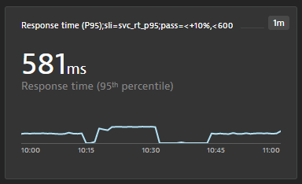

# Dynatrace SLI Service

[](https://travis-ci.org/keptn-contrib/dynatrace-sli-service)
[](https://goreportcard.com/report/github.com/keptn-contrib/dynatrace-sli-service)

The *dynatrace-sli-service* is a [Keptn](https://keptn.sh) service that is responsible for retrieving the values of Keptn-supported SLIs from a Dynatrace Metrics API endpoint.

By default, even if you do not specify a custom SLI.yaml, the following SLIs are automatically supported:

 - Throughput
 - Error rate
 - Response time p50
 - Response time p90
 - Response time p95

 These metrics are queried from a Dynatrace-monitored service entity with the tags `keptn_project`, `keptn_service`, `keptn_stage` & `keptn_deployment`.


 You can, however, define your custom SLI.yaml where you are free in defining your list of metrics coming from all monitored entities in Dynatrace (APPLICATION, SERVICE, PROCESS GROUP INSTANCE, HOST, CUSTOM DEVICE). More details on that are provided below.


## Compatibility Matrix

| Keptn Version    | [Dynatrace-SLI-Service Service Image](https://hub.docker.com/r/keptncontrib/dynatrace-sli-service/tags) |
|:----------------:|:----------------------------------------:|
|       0.6.0      | keptncontrib/dynatrace-sli-service:0.3.0 |
|       0.6.1      | keptncontrib/dynatrace-sli-service:0.3.1 |
|   0.6.1,0.6.2    | keptncontrib/dynatrace-sli-service:0.4.1 |
|   0.6.1,0.6.2    | keptncontrib/dynatrace-sli-service:0.4.2 |
|   0.7.0    | keptncontrib/dynatrace-sli-service:0.5.0 |
|   0.7.1    | keptncontrib/dynatrace-sli-service:0.6.0 |

## Installation

### Deploy in your Kubernetes cluster

* The `dynatrace-sli-service` by default validates the SSL certificate of the Dynatrace API.
  If your Dynatrace API only has a self-signed certificate, you can disable the SSL certificate check
  by setting the environment variable `HTTP_SSL_VERIFY` (default `true`) specified in the manifest available under `deploy/service.yaml` to `false`.

* To deploy the current version of the *dynatrace-sli-service* in your Kubernetes cluster, use the `deploy/service.yaml` file from this repository and apply it.
Please use the same namespace for the *dynatrace-sli-service* as you are using for Keptn.

    ```console
    kubectl apply -f deploy/service.yaml -n keptn
    ```

* This installs the *dynatrace-sli-service* into the `keptn` namespace, which you can verify using:

    ```console
    kubectl -n keptn get deployment dynatrace-sli-service -o wide
    kubectl -n keptn get pods -l run=dynatrace-sli-service
    ```

### Up- or Downgrading

Adapt and use the following command in case you want to up- or downgrade your installed version (specified by the `$VERSION` placeholder):

```console
kubectl -n keptn set image deployment/dynatrace-sli-service dynatrace-sli-service=keptncontrib/dynatrace-sli-service:$VERSION --record
```

### Uninstall

To delete a deployed *dynatrace-sli-service*, use the file `deploy/*.yaml` files from this repository and delete the Kubernetes resources:

```console
kubectl delete -f deploy/service.yaml -n keptn
```

## Setup

By default, the *dynatrace-sli-service* will use the same Dynatrace tenant and API token as provided for the [dynatrace-service](https://github.com/keptn-contrib/dynatrace-service).
In case you do not use the *dynatrace-service*, or if you want to use another Dynatrace tenant for a certain project, a secret containing the tenant ID and API token has to be deployed into the `keptn` namespace. 

```console
kubectl create secret generic dynatrace-credentials-<project> -n "keptn" --from-literal="DT_TENANT=$DT_TENANT" --from-literal="DT_API_TOKEN=$DT_API_TOKEN"
```

**Note:** There is a naming convention for the secret because this can be configured per **project**. Therefore, the secret has to have the name `dynatrace-credentials-<project>`.

**Using different Dynatrace environment per stage or service**

If you have multiple Dynatrace environments, e.g., to separately monitor pre-production and production environments, and therefore want the *dynatrace-sli-service* to connect to that respective Dynatrace environment when pulling SLI metrics for a specific Keptn stage or service you can do the following:

1. Create a secret for your additional Dynatrace environments in the same way as explained above and store them under a meaningful name, e.g: `dynatrace-preprod` or `dynatrace-prod`:

   ```
   kubectl create secret generic dynatrace-preprod -n "keptn" --from-literal="DT_TENANT=$DT_TENANT" --from-literal="DT_API_TOKEN=$DT_API_TOKEN"
   ```

2. Define a `dynatrace.conf.yaml` resource file, which allows you to specify a DTCreds value which has to be name of the secret, e.g.: `dynatrace-preprod`

   ```yaml
   spec_version: '0.1.0'
   dtCreds: dynatrace-preprod
   ```

3. Upload that `dynatrace.conf.yaml` to your Keptn project, stage, or service via [keptn add-resource](https://keptn.sh/docs/0.7.x/reference/cli/commands/keptn_add-resource/) into the dynatace folder, e.g: here is an example to upload it to a specific stage which means the *dynatrace-sli-service* will use the credentials stored in *dynatrace-preprod* secret for every SLI retrieval on that stage

    ```console
    keptn add-resource --project=yourproject --stage=yourstage --resource=./dynatrace.conf.yaml --resourceUri=dynatrace/dynatrace.conf.yaml
    ```


## SLI Configuration

The default SLI queries for this service are defined as follows: 

```yaml
spec_version: "1.0"
indicators:
 throughput: "metricSelector=builtin:service.requestCount.total:merge(0):sum&entitySelector=tag(keptn_project:$PROJECT),tag(keptn_stage:$STAGE),tag(keptn_service:$SERVICE),tag(keptn_deployment:$DEPLOYMENT),type(SERVICE)"
 error_rate: "metricSelector=builtin:service.errors.total.count:merge(0):avg&entitySelector=tag(keptn_project:$PROJECT),tag(keptn_stage:$STAGE),tag(keptn_service:$SERVICE),tag(keptn_deployment:$DEPLOYMENT),type(SERVICE)"
 response_time_p50: "metricSelector=builtin:service.response.time:merge(0):percentile(50)&entitySelector=tag(keptn_project:$PROJECT),tag(keptn_stage:$STAGE),tag(keptn_service:$SERVICE),tag(keptn_deployment:$DEPLOYMENT),type(SERVICE)"
 response_time_p90: "metricSelector=builtin:service.response.time:merge(0):percentile(90)&entitySelector=tag(keptn_project:$PROJECT),tag(keptn_stage:$STAGE),tag(keptn_service:$SERVICE),tag(keptn_deployment:$DEPLOYMENT),type(SERVICE)"
 response_time_p95: "metricSelector=builtin:service.response.time:merge(0):percentile(95)&entitySelector=tag(keptn_project:$PROJECT),tag(keptn_stage:$STAGE),tag(keptn_service:$SERVICE),tag(keptn_deployment:$DEPLOYMENT),type(SERVICE)"
```

**Note:** The default SLI queries require the following tags on the services and within the query:

* `keptn_project`
* `keptn_stage`
* `keptn_service`
* `keptn_deployment`

When Keptn queries these SLIs for e.g., the service `carts` in the stage `dev` within project `sockshop`, it would translate to the following tags in the query:

* `keptn_project:sockshop`
* `keptn_stage:dev`
* `keptn_service:carts`
* `keptn_deployment:primary` (or `keptn_deployment:canary` during tests)

If you use Keptn for the deployment of your artifacts using Keptn's Helm Service you will have these four tags automatically set and detected by Dynatrace. If you want to use other tags, you need to overwrite the SLI configuration (see below).

### Overwrite SLI Configuration / Custom SLI queries

Users can override the predefined queries, as well as add custom queries by creating a SLI configuration: 

* A custom SLI configuration is a YAML file as shown below:

    ```yaml
    ---
    spec_version: "1.0"
    indicators:
      your_metric: "metricSelector=your_metric:count&entitySelector=tag(keptn_project:$PROJECT),tag(keptn_stage:$STAGE),tag(keptn_service:$SERVICE),tag(keptn_deployment:$DEPLOYMENT),type(SERVICE)"
    ```

* To store this configuration, you need to add this file to Keptn's configuration store either on project, stage, or service level. The remote resourceUri needs to be `dynatrace/sli.yaml`. This is done by using the Keptn CLI with the [keptn add-resource](https://keptn.sh/docs/0.7.x/reference/cli/commands/keptn_add-resource/) command. Here is an example

    ```console
    keptn add-resource --project=yourproject --stage=yourstage --service=yourservice --resource=./sli.yaml --resourceUri=dynatrace/sli.yaml
    ```

### More examples on custom SLIs

You can define your SLI.yaml that defines ANY type of metric available in Dynatrace - on ANY entity type (APPLICATION, SERVICE, PROCESS GROUP, HOST, CUSTOM DEVICE, etc.). You can either "hard-code" the queries in your SLI.yaml or you can use placeholders such as $SERVICE, $STAGE, $PROJECT, $DEPLOYMENT as well as $LABEL.yourlabel1, $LABEL.yourlabel2. This is very powerful as you can define generic SLI.yaml files and leverage the dynamic data of a Keptn event. 
Here is an example where we are retrieving the tag name from a label that is passed to Keptn

```yaml
indicators:
    throughput:  "metricSelector=builtin:service.requestCount.total:merge(0):sum&entitySelector=tag($LABEL.dttag),type(SERVICE)"
```

So, if you are sending an event to Keptn and passing in a label with the name dttag and a value e.g: `evaluateforsli` then it will match a Dynatrace service that has this tag on it:


You can also have SLIs that span multiple layers of your stack, e.g: services, process groups and host metrics. Here is an example that queries one metric from a service, one from a process group and one from a host. The tag names come from labels that are sent to Keptn:

```yaml
indicators:
    throughput:  "metricSelector=builtin:service.requestCount.total:merge(0):sum&entitySelector=tag($LABEL.dtservicetag),type(SERVICE)"
    gcheapuse:   "metricSelector=builtin:tech.nodejs.v8heap.gcHeapUsed:merge(0):sum&entitySelector=tag($LABEL.dtpgtag),type(PROCESS_GROUP_INSTANCE)"
    hostmemory:  "metricSelector=builtin:host.mem.usage:merge(0):avg&entitySelector=tag($LABEL.dthosttag),type(HOST)"
```

Hope these examples help you see what is possible. If you want to explore more about Dynatrace Metrics, and the queries you need to create to extract them I suggest you explore the Dynatrace API Explorer (Swagger UI) as well as the [Metric API v2](https://www.dynatrace.com/support/help/extend-dynatrace/dynatrace-api/environment-api/metric-v2/) documentation.

## SLIs & SLOs via Dynatrace Dashboard

**New capability with 0.5.0**

Based on user feedback we learned that defining custom SLIs via the SLI.yaml and then defining SLOs via SLO.yaml can be challenging as one has to be familiar with the Dynatrace Metrics V2 API to craft the necessary SLI queries.
As dashboards are a prominent feature in Dynatrace to visualize metrics, it was a logical step to leverage dashboards as the basis for Keptn's SLI/SLO configuration.

*rocket* If *dynatrace-sli-service* parses your dashboard, it will generate an `sli.yaml` and `slo.yaml` and uploads it to your Keptn configuration repository.

### How dynatrace-sli-service locates a Dashboard

There are two options for the *dynatrace-sli-service* to parse a dashboard instead of relying on an SLI.yaml:

1. Have a dashboard on your Dynatrace Tenant with the name pattern like this: KQG;project=<YOURKEPTNPROJECT>;service=<YOURKEPTNSERVICE>;stage=<YOURKEPTNSTAGE>

1. In your `dynatrace.conf.yaml` define a property called dashboard and give it the dashboard id as value, e.g: `dashboard: e6c947f2-4c29-483c-a065-269b3707bea4`

If the *dynatrace-sli-service* doesn't locate a dashboard, it defaults back to the SLI.yaml that you have uploaded in your Keptn configuration repository.

### SLI/SLO Dashboard Layout and how it generates SLI & SLO definitions

Here is a sample dashboard for our simplenode sample application:


And here is how the individual pieces matter:

**1. Name of the dashboard**

If the dashboard is not referenced in `dynatrace.conf.yaml` via the Dashboard ID, the *dynatrace-sli-service* queries all dashboards and uses the one that starts with KQG; followed by the name-value pairs:

```
project=<project>,service=<service>,stage=<stage>
```

The order of these name-value pairs is not relevant but the values have to match your Keptn project, service and stage. In the example dashboard you see that this dashboard matches the project *simpleproject*, service *simplenode*, and stage *staging*.

**2. Management Zone Filter**

If you are building a dashboard specific to an application or part of your environment, it is a good practice to set a default management zone filter for your dashboard. The *dynatrace-sli-service* will use that filter. This can either be a custom created management zone or - like in the example above - the one that Keptn creates in case you use Keptn for the deployment.

**3. Markdown with SLO Definitions**

The dashboard is not only used to define which metrics should be evaluated (list of SLIs), it is also used to define the individual SLOs and global settings for the SLO, e.g., *Total Score* goals or *Comparison Rules*. These are settings you normally have in your SLO.yaml.
To specify those settings simply create a markdown that contains name-value pairs like in the example dashboard.

Here is the text from that markup you see in the screenshot:
```
KQG.Total.Pass=90%;KQG.Total.Warning=75%;KQG.Compare.WithScore=pass;KQG.Compare.Results=1;KQG.Compare.Function=avg
```

It is not mandatory to define them as there are defaults for all of them. Here is a table that gives you the details on each setting:

| Setting | Default | Comment |
|:------|:-------|:-------|
| KQG.Total.Pass | 90% | Specifies total pass goal of your SLO |
| KQG.Total.Warning | 75% | Specifies total warning goal of your SLO |
| KQG.Compare.Result | 1 | Against how many previous builds to compare your result to? |
| KQG.Compare.WithScore | pass | Which prevoius builds to include in the comparison: pass, pass_or_warn or all |
| KQG.Compare.Function | avg | When comparing against multiple builds which aggregation should be used: avg, p50, p90, p95 |


**4. Tiles with SLI definition**

The *dynatrace-sli-service* analyzes every tile but only includes those in the SLI/SLO anlaysis where the tile name includes the name-value pair: `sli=sliprefix`

If you look at the example dashboard screenshot, you see some tiles that have the `sli=sliprefix` and some that don't. This allows you to build dashboards that you can extend with metrics that should not be included in your SLI/SLO validation.

Similar to the markdown, each tile can define several configuration elements. The only mandatory is sli=sliprefix.
Here a couple of examples of possible values. It actually starts with a human readable value that is not included in the analysis but makes the dashboard easier readable:

```
Test Step Response Time;sli=teststep_rt;pass=<500;warning=<1000;weight=2
Process Memory;sli=process_memory
Response time (P50);sli=svc_rt_p95;pass=<+10%,<500
```

| Setting | Sample Value | Comment |
|:------|:-------|:-------|
| sli | test_rt | This will become the SLI Name, e.g: test_Rt If the chart includes metrics split by dimensions - then the value is a prefix and each dimension will be appended, e.g: test_rt_teststep1, test_rt_teststep2 |
| pass | <500,<+10% | This can be a comma-separated list which allows you to specify multiple critiera as you can also do in the SLO.yaml. You are also allowed to specify multiple pass name/value pairs which will result into multiple criteria just as allowed in the SLO.yaml spec |
| warning | <1000 | Same as with pass |
| weight | 1 | Allows you to define a weight of the SLI. Default is 1 |
| key | true | If true, this SLI becomes a key SLI. Default is false |

**5. Tile examples**

Here a couple of examples from tiles and how they translate into SLI.yaml and SLO.yaml definitions

*1: Service Response Time (p95)*

 

* Results in an SLI.yaml like this:

    ```
    svc_rt_p95: metricSelector=builtin:service.response.time:percentile(50):names;entitySelector=type(SERVICE),mzId(-8783122447839702114)
    ```

* And an SLO.yaml definition like this:

    ```
    - sli: svc_rt_p95
      pass:
        - criteria
            - "<+10%"
              "<600"
      weight 1
      key_sli: false
    ```


*2: Test Step Response Time*

 

* Result in an SLI definition like this

    ```
    teststep_rt_Basic_Check: "metricSelector=calc:service.teststepresponsetime:merge(0):avg:names:filter(eq(Test Step,Basic Check));entitySelector=type(SERVICE),mzId(-8783122447839702114)",
    teststep_rt_echo: "metricSelector=calc:service.teststepresponsetime:merge(0):avg:names:filter(eq(Test Step,echo));entitySelector=type(SERVICE),mzId(-8783122447839702114)",
    teststep_rt_homepage: "metricSelector=calc:service.teststepresponsetime:merge(0):avg:names:filter(eq(Test Step,homepage));entitySelector=type(SERVICE),mzId(-8783122447839702114)",
    teststep_rt_invoke: "metricSelector=calc:service.teststepresponsetime:merge(0):avg:names:filter(eq(Test Step,invoke));entitySelector=type(SERVICE),mzId(-8783122447839702114)",
    teststep_rt_version: "metricSelector=calc:service.teststepresponsetime:merge(0):avg:names:filter(eq(Test Step,version));entitySelector=type(SERVICE),mzId(-8783122447839702114)",
    ```

* And an SLO like this:
    ```
        - sli: teststep_rt_invoke
          pass:
            - criteria
                - "<500"
          warning:
            - criteria
                - "<1000"
          weight 2
          key_sli: false
        - sli: teststep_rt_version
          pass:
            - criteria
                - "<500"
          warning:
            - criteria
                - "<1000"
          weight 2
          key_sli: false      
          ...
    ```

### Support for USQL Tiles

The *dynatrace-sli-service* also supports Dynatrace USQL tiles. The query will be executed as defined in the dashboard for the given timeframe of the SLI evaluation.

There are just some things to know for the different USQL result types:
|Tile Type| Comment |
|:-------|:---------|
| Single | Just a single value |
| Pie Chart | Takes dimension name and value |
| Column Chart | First columns is considered dimension and second is the value |
| Table | First column is considered dimension and last column the value |
| Funnel | Currently not supported |


Here is an example with two USQL Tiles showing a single value of a query:


This will translate into two SLIs called `camp_adoption` and `camp_conv`. The SLO definition is the same as explained above with regular time series. 

### Steps to setup a Keptn project for SLI/SLO Dashboards

This should work with any existing Keptn project you have. Just make sure you have the *dynatrace-sli-service* enabled for your project. 
Then create a dashboard as explained above that the *dynatrace-sli-service* can match to your project/service/stage. 

If you start from scratch and you have never run an evaluation in your project make sure you upload an empty SLO.yaml to your service. Why? Because otherwise the Lighthouse service will skip evaluation and never triggers the *dynatrace-sli-service*. This is just a one time initialization effort.
Here is an empty slo.yaml you can use:
```
---
spec_version: '0.1.0'
comparison:
objectives:
```

Also check out the samples folder of this repo with some additional helper files and the exported dashboard from the example above.

## Development

* Get dependencies: `go mod download`
* Build locally: `go build -v -o dynatrace-sli-service ./cmd/`
* Run tests: `go test -race -v ./...`
* Run local: `ENV=local ./dynatrace-sli-service`

## Known Limitations

* The Dynatrace Metrics API provides data with the "eventually consistency" approach. Therefore, the metrics data retrieved can be incomplete or even contain inconsistencies in case of time frames that are within two hours of the current datetime. Usually, it takes a minute to catch up, but in extreme situations this might not be enough. We try to mitigate that by delaying the API Call to the metrics API by 60 seconds.

* This service uses the Dynatrace Metrics v2 API by default but can also parse V1 metrics query. If you use the V1 query language you will see warning log outputs in the *dynatrace-sli-service* which encourages you to update your queries to V2. More information about Metics V2 API can be found in the [Dynatrace documentation](https://www.dynatrace.com/support/help/extend-dynatrace/dynatrace-api/environment-api/metric-v2/)
