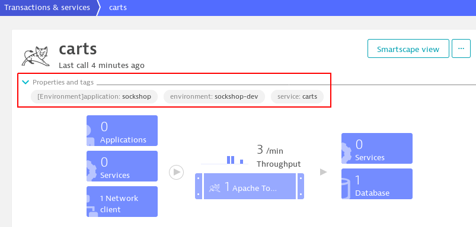

# Dynatrace Integration

Within this document the integration of this service with Dynatrace is described.

## Tenant and API Token

The Dynatrace Tenant and an API Token need to be stored in a `.yaml` file and added as a Kubernetes secret using
```console
kubectl create secret generic dynatrace-credentials-${PROJECTNAME} -n "keptn" --from-file=dynatrace-credentials=dynatrace-credentials.yaml
```
where `${PROJECTNAME}` is the name of the project as specified within the `keptn create project` command (e.g., `sockshop`).

## Tags

The following tags are expected to be set on the monitored **services** within Dynatrace:

* `environment` - maps to the stage within Keptn (basically the Kubernetes namespace, e.g., `sockshop-dev`, `sockshop-staging` or `sockshop-production`)
* `service` - maps to the name of the service within Keptn (e.g., `carts`)



At the moment only timeseries starting with a prefix of `com.dynatrace.builtin:service.` are supported.

## Timeseries Mapping

The following metrics are supported by Keptn

* Throughput (number of requests per second that have been processed)
* ErrorRate (fraction of all received requests that produced an error)
* ResponseTime (how long it takes to return a response to a request)
    * ResponseTimeP50 
    * ResponseTimeP90
    * ResponseTimeP95

and mapped to Dynatrace timeseries data as follows:

| Name               | Metric                                          | AggregationType               |
|--------------------|-------------------------------------------------|-------------------------------|
| Throughput         | builtin:service.requestCount.total              | count                         |
| ErrorRate          | builtin:service.errors.total.count              | avg                           |
| ResponseTimeP50    | builtin:service.response.time[^1]               | percentile (`percentile=50`)  |
| ResponseTimeP90    | builtin:service.response.time[^1]               | percentile (`percentile=90`)  |
| ResponseTimeP95    | builtin:service.response.time[^1]               | percentile (`percentile=95`)  |

More information about timeseries and available metrics can be found 
[here](https://www.dynatrace.com/support/help/extend-dynatrace/dynatrace-api/environment-api/metric/).

[^1] service.response.time is returned in microseconds by Dynatrace API, and converted to milliseconds within this service.

## Result Data

A result looks as follows:

```json
{
    "totalCount": 4,
    "nextPageKey": null,
    "metrics": {
        "builtin:service.response.time:merge(0):percentile(50)": {
            "values": [
                {
                    "dimensions": [],
                    "timestamp": 1574092860000,
                    "value": 1364.0454545454545
                }
            ]
        }
    }
}
```

## Keptn Performance Tests

If performance tests are triggered within Keptn, an additional tag is automatically set within Dynatrace: 
 `test-subject:true`. This enables us to separate services that have only been created for testing (e.g., new artifacts) 
 from services that have been deployed before.
 