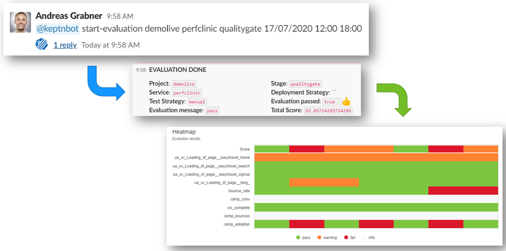

# BizOps Dashboard Example

This is the example shown during the Performance Clinic called [Automate Business Level Objective Monitoring with Dynatrace](https://info.dynatrace.com/global_all_wc_performance_clinic_automate_business_level_objective_monitoring_15208_registration.html)

## Demolive project

This sample works well with the Dynatrace Demo Live environment which hosts a couple of sample applications such as easyTravel.
In order to demo the "BizOps" use case where Keptn is used to notify Dynatrace about Marketing Campaigns as well as for pulling BLOs (Business Level Objectives) from Dynatrace to evaluate the success of a marketing capaign we need to create a Keptn Project, Create a Service, Create a BLO Dashboard and provide a dynatrace.conf.yaml for the Dynatracce SErvice to push events to the easyTravel Application.

```
Step 1: Create Project and Service
keptn create project demolive --shipyard=./shipyard.yaml
keptn create service perfclinic --project=demolive

Step 2: Enable Dynatrace-SLI-Provider
CHECK DOC for creating the ConfigMap Entry

Step 3: Ensure Dynatrace Dashboard on your tenant
You can use the dashboard in this folder!

Step 4: Upload an empty SLO.yaml so that dashboard based evalution works!
keptn add-resource --project=demolive --stage=qualitygate --service=perfclinic --resource=./slo.yaml

Step 5: Upload dynatrace.conf.yaml into the dynatrace subfolder
keptn add-resource --project=demolive --stage=qualitygate --service=perfclinic --resource=./dynatrace.conf.yaml --resourceUri=dynatrace/dynatrace.conf.yaml

```

## Execute a query using Keptn ChatBot

One of the demos shown was using the Keptn ChatBot Service to trigger an evaluation. You can install the Keptn Slackbot as explained on the [Slackbot Service GItHub repo](https://github.com/keptn-sandbox/slackbot-service/)

Once configured you can execute queries like this: 
```
@keptnbot start-evaluation demolive perfclinic qualitygate 18/07/2020 12:00 18:00
```



## Execute a Campaign Start Event

Another demo we showed was using Keptn to not only evaluate a timerange but leverage the deployment finished event to send an event regarding a marketing campaign start to Dynatrace. Followed by that is an evaluation.

If you want to do this make sure to edit the deploy-finished.json to contain accurate meta data, e.g: campaign name ...

```
keptn send event --file=./deploy-finished.json
```

